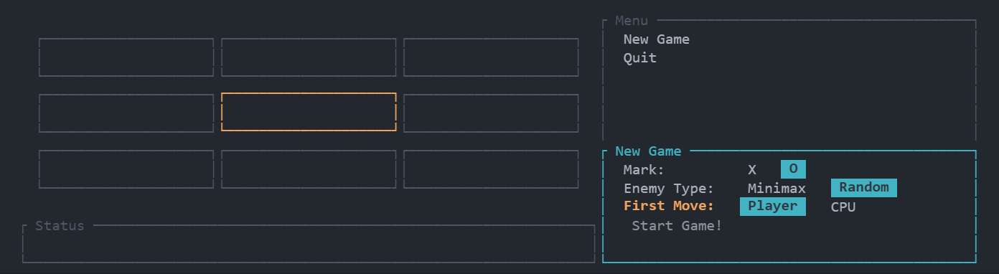

# tic-tac-toe

A basic Tic-Tac-Toe application written in Rust, used as a learning exercise in Rust and UI development.

The TUI is created using [tuirealm](https://github.com/veeso/tui-realm/).

> [!NOTE]
> The TUI is not intended to be a shining pinnacle of design or usability, but rather a sandbox for learning how to build TUIs in Rust.
> I have tried to make it as user-friendly as possible within the constraints of the project, but there are likely many areas for improvement (especially for small or unusual terminal sizes).

## Playing the Game
To play the game, simply clone the repository and run the application via `cargo run`. \
Menu navigation is done via either the arrow keys, `WASD` or `HJKL` (for you Vim fans out there). \
Submitting a move is done via `Enter` or `Space`, and `Esc` will toggle between the game board and sidebar.

## Images

